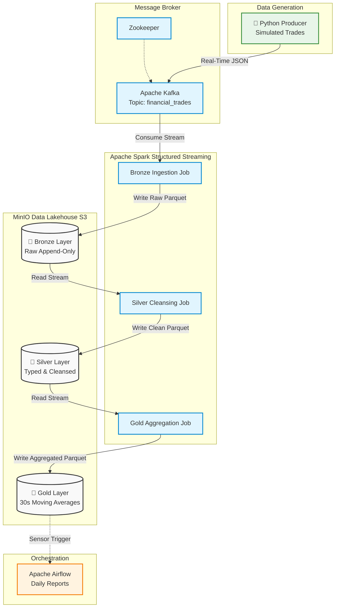

# Real-Time Streaming Data Lakehouse 

An end-to-end data engineering pipeline that ingests, processes, and analyzes real-time financial market data using a **Medallion Architecture** (Bronze, Silver, Gold).

##  Architecture Overview

This project simulates a high-throughput financial trading environment. Data is generated in real-time, buffered through a distributed messaging system, processed incrementally using stream processing, and stored in an S3-compatible data lake.

1. **Data Generation:** A Python producer generates synthetic stock market trades and streams them to Kafka.
2. **Ingestion (Bronze Layer):** Apache Spark consumes the Kafka stream and writes the raw JSON payloads to S3 (MinIO) in Parquet format. Append-only and immutable.
3. **Processing (Silver Layer):** A second Spark streaming job reads the Bronze data, enforces a strict schema, casts data types, applies data quality filters (e.g., dropping negative prices), and writes the clean data to the Silver bucket.
4. **Aggregation (Gold Layer):** A final Spark job calculates 30-second windowed moving averages and total trading volume, utilizing **Watermarking** to handle late-arriving data.
5. **Orchestration:** Apache Airflow manages batch dependencies and reporting schedules on top of the Gold layer.

##  Tech Stack

*   **Languages:** Python, SQL
*   **Stream Processing:** Apache Spark (Structured Streaming), PySpark
*   **Message Broker:** Apache Kafka, Zookeeper
*   **Storage:** S3-compatible Object Storage (MinIO), Parquet
*   **Orchestration:** Apache Airflow
*   **Infrastructure:** Docker & Docker Compose

##  Key Engineering Concepts Demonstrated

*   **Medallion Architecture:** Logical separation of data states (Raw -> Cleansed -> Aggregated) for optimal analytics and ML model training.
*   **Fault Tolerance:** Implemented Spark Checkpointing to ensure the pipeline can recover exactly where it left off in the event of a node failure.
*   **Late Data Handling:** Utilized event-time processing and watermarking to gracefully handle network delays in the Gold aggregation layer.
*   **Infrastructure as Code (IaC):** Containerized the distributed systems (Kafka, Zookeeper, MinIO) via `docker-compose` for local reproducibility.

##  How to Run Locally

### Prerequisites
*   Docker Desktop
*   Python 3.9+
*   Java 17 (Required for Apache Spark)
*   *Windows Users:* Hadoop `winutils.exe` configured in `C:\hadoop\bin`

### 1. Start the Infrastructure
Bash
docker compose up -d
Wait ~10 seconds for the automated script to provision the Bronze, Silver, and Gold S3 buckets. You can view the storage UI at http://localhost:9001 (admin / password123).

2. Setup the Environment
Bash
python -m venv venv
source venv/bin/activate  # On Windows: venv\Scripts\activate
pip install -r requirements.txt

3. Run the Pipeline
Note: Run each of these commands in a separate terminal window with the virtual environment activated.

Terminal 1 (Data Generator):
Bash
python 
src/producer/main.py

Terminal 2 (Bronze Ingestion):
Bash
python 
src/streaming/bronze_ingestion.py

Terminal 3 (Silver Processing):
Bash
python 
src/streaming/silver_processing.py

Terminal 4 (Gold Analytics):
Bash
python 
src/streaming/gold_aggregation.py

Future enhancements:
Prometheus & Grafana Integration: Add a docker-compose service for Prometheus and Grafana. Use Spark's built-in metrics system to export streaming latency, throughput (records/sec), and batch duration metrics to Prometheus.

Custom Health Checks: Add a script that monitors the "consumer lag" in Kafka. If the lag exceeds a certain threshold, the pipeline is falling behind in real-time.
Great Expectations or Deequ: Integrate a validation step in your Silver-to-Gold transition. For example, automatically fail the pipeline or quarantine rows if the trade_price is an extreme outlier (e.g., 3 standard deviations from the mean).

Dead Letter Queue (DLQ): Instead of just "dropping" bad records in the Silver layer, write them to a separate errors/ directory in S3. This allows for post-mortem analysis of why specific data points were rejected.