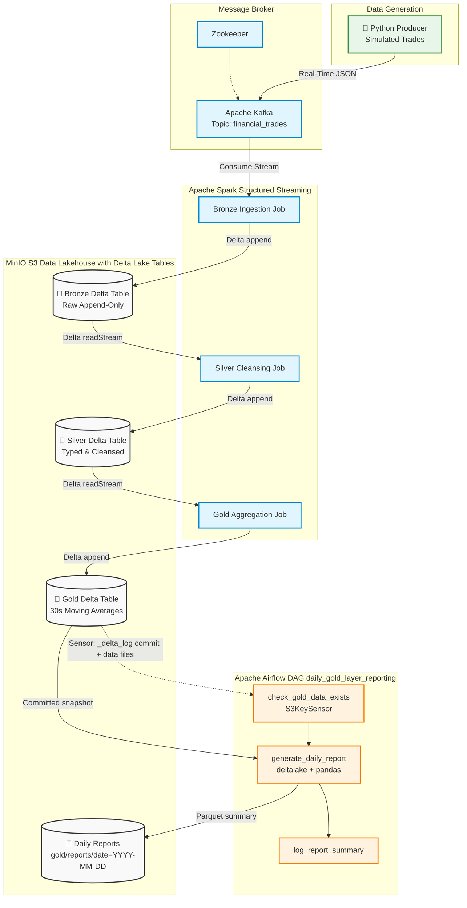

# Real-Time Streaming Data Lakehouse

An end-to-end data engineering pipeline that ingests, processes, and analyzes real-time financial market data using a **Medallion Architecture** (Bronze, Silver, Gold) built on **Delta Lake** tables.

##  Architecture Overview

This project simulates a high-throughput financial trading environment. Data is generated in real-time, buffered through a distributed messaging system, processed incrementally using stream processing, and stored as Delta Lake tables in an S3-compatible data lake.

1. **Data Generation:** A Python producer generates synthetic stock market trades and streams them to Kafka at a configurable pace (`--rate`, `--burst`, `--count`).
2. **Ingestion (Bronze Layer):** Apache Spark consumes the Kafka stream and appends the raw JSON payloads to the Bronze Delta table in MinIO (`s3a://bronze/financial_trades/`). Append-only and immutable.
3. **Processing (Silver Layer):** A second Spark streaming job streams the Bronze Delta table, enforces a strict schema, casts data types, applies data quality filters (e.g., dropping negative prices), and appends the clean data to the Silver Delta table.
4. **Aggregation (Gold Layer):** A final Spark job streams the Silver table and calculates 30-second windowed moving averages and total trading volume, utilizing **Watermarking** to handle late-arriving data, and appends them to the Gold Delta table.
5. **Orchestration:** A daily Apache Airflow DAG waits until the Gold table has data, writes a per-symbol daily summary to `s3a://gold/reports/date=YYYY-MM-DD/`, and logs a short summary.

Timestamps are UTC end to end: the producer writes ISO-8601 timestamps with an explicit offset, and the Spark jobs run with `spark.sql.session.timeZone=UTC`.


```mermaid
graph TD
    %% Define styles
    classDef storage fill:#f9f9f9,stroke:#333,stroke-width:2px;
    classDef process fill:#e1f5fe,stroke:#0288d1,stroke-width:2px;
    classDef source fill:#e8f5e9,stroke:#388e3c,stroke-width:2px;
    classDef orchestration fill:#fff3e0,stroke:#f57c00,stroke-width:2px;

    %% Nodes
    subgraph gen [Data Generation]
        P[🐍 Python Producer<br/>Simulated Trades]:::source
    end

    subgraph broker [Message Broker]
        K[Apache Kafka<br/>Topic: financial_trades]:::process
        Z[Zookeeper]:::process
        Z -.-> K
    end

    subgraph spark [Apache Spark Structured Streaming]
        SB[Bronze Ingestion Job]:::process
        SS[Silver Cleansing Job]:::process
        SG[Gold Aggregation Job]:::process
    end

    subgraph lake [MinIO S3 Data Lakehouse with Delta Lake Tables]
        B[("🥉 Bronze Delta Table<br/>Raw Append-Only")]:::storage
        S[("🥈 Silver Delta Table<br/>Typed & Cleansed")]:::storage
        G[("🥇 Gold Delta Table<br/>30s Moving Averages")]:::storage
        R[("📄 Daily Reports<br/>gold/reports/date=YYYY-MM-DD")]:::storage
    end

    subgraph dag [Apache Airflow DAG daily_gold_layer_reporting]
        A1[check_gold_data_exists<br/>S3KeySensor]:::orchestration
        A2[generate_daily_report<br/>deltalake + pandas]:::orchestration
        A3[log_report_summary]:::orchestration
        A1 --> A2 --> A3
    end

    %% Flow
    P -->|Real-Time JSON| K
    K -->|Consume Stream| SB
    SB -->|Delta append| B
    B -->|Delta readStream| SS
    SS -->|Delta append| S
    S -->|Delta readStream| SG
    SG -->|Delta append| G
    G -.->|"Sensor: _delta_log commit + data files"| A1
    G -->|Committed snapshot| A2
    A2 -->|Parquet summary| R
```

##  Tech Stack

*   **Languages:** Python, SQL
*   **Stream Processing:** Apache Spark 3.5 (Structured Streaming), PySpark
*   **Table Format:** Delta Lake 3.2 (`delta-spark`), plus `deltalake` (delta-rs) for the Airflow report
*   **Message Broker:** Apache Kafka, Zookeeper
*   **Storage:** S3-compatible Object Storage (MinIO), Delta Lake (Parquet data files + transaction log)
*   **Orchestration:** Apache Airflow 2.9 (standalone mode in Docker)
*   **Infrastructure:** Docker & Docker Compose

##  Key Engineering Concepts Demonstrated

*   **Medallion Architecture:** Logical separation of data states (Raw -> Cleansed -> Aggregated) for optimal analytics and ML model training.
*   **ACID Transactions:** Every micro-batch is committed atomically to its table's Delta transaction log, so downstream streams and the Airflow report only ever read complete, committed batches. Table schemas are stored in the log instead of being hand-written in each reader.
*   **Fault Tolerance:** Spark Checkpointing plus Delta's idempotent streaming sink let each job recover exactly where it left off after a failure, without losing or duplicating a batch (see the correctness check under [Results](#results)).
*   **Late Data Handling:** Utilized event-time processing and watermarking to gracefully handle network delays in the Gold aggregation layer.
*   **Observability:** Each job logs Spark's per-batch progress (input and processed rows per second, batch duration) and appends it to `metrics/<job>_progress.jsonl`.
*   **Infrastructure as Code (IaC):** Containerized the distributed systems (Kafka, Zookeeper, MinIO, Airflow) via `docker-compose` for local reproducibility.

##  Project Structure

```text
dags/daily_gold_report_dag.py   Airflow DAG: S3KeySensor -> daily report -> summary log
docker/airflow/Dockerfile       Airflow 2.9.3 image plus the deltalake package
docker-compose.yml              Zookeeper, Kafka, MinIO (+ bucket setup) and Airflow
scripts/benchmark.py            Producer throughput benchmark (burst mode)
scripts/summarize_metrics.py    Summarises metrics/<job>_progress.jsonl
src/common/                     Shared settings (.env), SparkSession factory, progress logger
src/producer/main.py            Trade generator (--rate / --burst / --count)
src/streaming/                  Bronze, Silver and Gold streaming jobs
```

##  Configuration

Connection settings are environment variables with local defaults. To change them, copy `.env.example` to `.env`: `docker compose` and the Python jobs both read it, and variables already set in your shell take precedence.

| Variable | Default | Used by |
|---|---|---|
| `KAFKA_BOOTSTRAP_SERVERS` | `localhost:9092` | Producer, Bronze job, benchmark |
| `MINIO_ENDPOINT` | `http://localhost:9000` | Spark jobs |
| `MINIO_ACCESS_KEY` / `MINIO_SECRET_KEY` | `admin` / `password123` | Spark jobs, plus the MinIO root user, bucket setup and Airflow's `minio_s3` connection in `docker-compose.yml` |
| `AIRFLOW_ADMIN_USER` / `AIRFLOW_ADMIN_PASSWORD` | `admin` / `admin` | Airflow web UI login |
| `HADOOP_HOME` | not set | Windows only: the folder that contains `bin\winutils.exe` |
| `METRICS_DIR` | `metrics` | Where the jobs append `<job>_progress.jsonl` (relative to the repo root) |

##  How to Run Locally

### Prerequisites
*   Docker Desktop
*   Python 3.9+ (tested with 3.14.5)
*   Java 17 (Required for Apache Spark)
*   *Windows Users:* Hadoop `winutils.exe` and `hadoop.dll` in `C:\hadoop\bin`, and `HADOOP_HOME=C:\hadoop` set in your shell or in `.env`. The Spark jobs add `%HADOOP_HOME%\bin` to their own `PATH` so that `hadoop.dll` can be loaded.
*   Internet access on the first run: Spark downloads the Kafka, Delta Lake and S3A packages, and Docker builds the Airflow image.

### 1. Start the Infrastructure

```bash
cp .env.example .env    # optional: without it the defaults above are used
docker compose up -d --build
```

This starts Zookeeper, Kafka, MinIO and Airflow; the `minio-setup` container creates the `bronze`, `silver` and `gold` buckets as soon as MinIO accepts connections.

*   MinIO console: http://localhost:9001 (login `admin` / `password123`, i.e. `MINIO_ACCESS_KEY` / `MINIO_SECRET_KEY`)
*   Airflow UI: http://localhost:8080 (login `admin` / `admin`, i.e. `AIRFLOW_ADMIN_USER` / `AIRFLOW_ADMIN_PASSWORD`). The first start takes about a minute.

### 2. Setup the Environment

```bash
python -m venv venv
source venv/bin/activate  # On Windows: venv\Scripts\activate
pip install -r requirements.txt
```

### 3. Run the Pipeline

Run each of these commands in a separate terminal window with the virtual environment activated. Start the producer first: it creates the Kafka topic that the Bronze job subscribes to. Silver and Gold wait until their upstream Delta table has its first commit.

Terminal 1 (Data Generator):

```bash
python src/producer/main.py
```

Terminal 2 (Bronze Ingestion):

```bash
python src/streaming/bronze_ingestion.py
```

Terminal 3 (Silver Processing):

```bash
python src/streaming/silver_processing.py
```

Terminal 4 (Gold Analytics):

```bash
python src/streaming/gold_aggregation.py
```

Without flags the producer keeps its original pace (a random 0.1–0.8 s pause between events) until Ctrl+C. To control the throughput instead:

```bash
python src/producer/main.py --rate 100                # 100 events per second
python src/producer/main.py --burst --count 100000    # no pause (batched sends), stop after 100,000 events
```

After every micro-batch each job prints a progress line and appends the full record to `metrics/<job>_progress.jsonl`:

```text
[bronze] batch 114: 600000 rows | input 0.0 rows/s | processed 33,562.7 rows/s | batch duration 17877 ms
```

Gold only commits a 30-second window once the watermark (30 seconds behind the newest trade) has passed the end of that window, so its first rows appear a minute or two after data starts flowing.

### 4. Run the Airflow DAG

`daily_gold_layer_reporting` runs three tasks:

1. `check_gold_data_exists`: an `S3KeySensor` that uses the `minio_s3` AWS connection (its `endpoint_url` points to MinIO) and waits until the Gold table has a Delta commit and data files.
2. `generate_daily_report`: reads the Gold Delta table with the `deltalake` package and, for that UTC day, writes one row per symbol (average of the 30-second window prices, total volume, number of windows) to `s3a://gold/reports/date=YYYY-MM-DD/daily_summary.parquet`. Re-running a day overwrites its report.
3. `log_report_summary`: logs a short summary, including the Gold table version the report was built from.

New DAGs start paused; unpause it in the Airflow UI to run it every day (each run reports on its logical date). To run it once, end to end, for today (UTC):

```bash
docker compose exec -T airflow airflow dags test daily_gold_layer_reporting $(date -u +%F)
```

### 5. Measure Throughput

With the infrastructure and the three streaming jobs running, and the regular producer stopped, run the benchmark and then summarise the jobs' progress for the period it printed as its start time. These are the exact commands behind the live numbers in [Results](#results):

```bash
python scripts/benchmark.py --count 200000 --runs 3
python scripts/summarize_metrics.py --since 2026-09-28T17:33:12Z --until 2026-09-28T17:37:34Z
```

`benchmark.py` sends the events in burst mode (Kafka producer batching with `linger_ms=20` and `batch_size=256 KB`) and prints, per run, the events/sec acknowledged by the broker and how much the topic grew. `summarize_metrics.py` prints, per job, the batches that read data in that period, their median and maximum `processedRowsPerSecond`, and the average batch duration.

### Stopping and Resetting

Press Ctrl+C in each terminal to stop the producer and the Spark jobs, then:

```bash
docker compose down -v    # stop the containers and delete the Kafka and MinIO data volumes
```

Kafka and MinIO keep their data in anonymous volumes, so the stack starts empty after every `down`. If you are upgrading from the earlier Parquet version while its containers are still running, run `docker compose down -v` first: the Delta tables and checkpoints reuse the same paths.

##  Results

Measured on 2026-09-28 with the commands above. Every number below comes from a real run on this machine.

**Machine:** Lenovo 82B5 laptop, AMD Ryzen 5 4600H (6 cores / 12 threads), 15.4 GB RAM, Windows 11 Home (build 26200), Docker Desktop 4.81.0 (WSL 2 VM with 12 vCPUs and 7.4 GiB), Java 17.0.19 (Temurin), Python 3.14.5, PySpark 3.5.0 in `local[*]` mode, Delta Lake 3.2.0. Everything ran on this one laptop: Kafka, Zookeeper, MinIO and Airflow in Docker, and the three Spark jobs as separate JVMs on the host with default settings (1 Kafka partition, 200 shuffle partitions). Other desktop apps were open; free RAM was between 0.4 and 4.8 GB during the runs.

### Producer (`scripts/benchmark.py --count 200000 --runs 3`)

| Condition | Run 1 | Run 2 | Run 3 | Mean |
|---|---:|---:|---:|---:|
| Spark jobs stopped | 12,840 | 12,703 | 12,764 | **12,769 events/s** |
| All three Spark jobs running | 5,762 | 4,376 | 4,850 | **4,996 events/s** |

The broker acknowledged every event (0 failures), and the topic grew by exactly 200,000 records per run.

### Streaming jobs (`processedRowsPerSecond` from `metrics/<job>_progress.jsonl`)

**Live:** the three jobs running while the benchmark above sent 3 × 200,000 events at about 5,000 events/s.

| Layer | Micro-batches | Rows | Median | Max | Rows ÷ total batch time | Avg batch duration |
|---|---:|---:|---:|---:|---:|---:|
| Bronze | 30 | 600,000 | 5,234 | 8,892 | 4,746 | 4.2 s |
| Silver | 25 | 600,000 | 4,472 | 9,794 | 4,865 | 4.9 s |
| Gold | 9 | 600,000 | 4,144 | 6,576 | 3,886 | 17.2 s |

**Catch-up:** 600,000 events were produced while the jobs were stopped. After a restart, each job processed that backlog as a single micro-batch.

| Layer | Rows | Batch duration | processedRowsPerSecond |
|---|---:|---:|---:|
| Bronze | 600,000 | 17.9 s | 33,563 |
| Silver | 600,000 | 16.5 s | 36,271 |
| Gold | 600,000 | 20.7 s | 29,054 |

**Default producer pace (~2 events/s):** the median batch read 9 rows in Bronze and Silver and 36 in Gold, and took 3.9 s (Bronze), 4.2 s (Silver) and 15.4 s (Gold).

**Observations**

*   Most of each batch's time is fixed overhead, so throughput grows with batch size. In the live run Bronze and Silver kept up with the ~5,000 events/s producer; working through a backlog, the same jobs processed 29,000–36,000 rows/s.
*   In every job, most of the batch time is `addBatch`, which writes the micro-batch and commits it to the Delta table. At the default pace its median share was 88% (Bronze), 78% (Silver) and 94% (Gold). Gold is the only stateful job, and its state store has 200 partitions (the `spark.sql.shuffle.partitions` default), each checkpointed to MinIO. Lowering that on a single machine is the first thing to try; its effect has not been measured here.
*   With the Spark jobs running on the same laptop, the producer dropped from about 12,800 to about 5,000 events/s.
*   **Correctness check:** after several forced restarts of the jobs, Kafka held 1,201,295 records, Bronze and Silver each had 1,201,295 rows, Silver had 1,201,295 distinct `trade_id`s, and Gold had no duplicate (window, symbol) rows. The DAG's daily report matched a summary recomputed from the Gold table time-travelled to the version the DAG had read.

##  Future Enhancements

*   **Prometheus & Grafana Integration:** Add a docker-compose service for Prometheus and Grafana. Use Spark's built-in metrics system to export streaming latency, throughput (records/sec), and batch duration metrics to Prometheus.
*   **Custom Health Checks:** Add a script that monitors the "consumer lag" in Kafka. If the lag exceeds a certain threshold, the pipeline is falling behind in real-time.
*   **Great Expectations or Deequ:** Integrate a validation step in your Silver-to-Gold transition. For example, automatically fail the pipeline or quarantine rows if the trade_price is an extreme outlier (e.g., 3 standard deviations from the mean).
*   **Dead Letter Queue (DLQ):** Instead of just "dropping" bad records in the Silver layer, write them to a separate errors/ directory in S3. This allows for post-mortem analysis of why specific data points were rejected.
